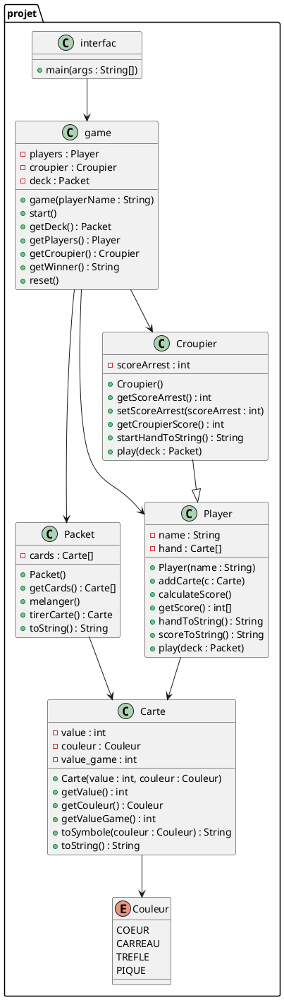

# Projet Fil Rouge : Black Jack ctrl+maj+v

> **Auteurs :**
>
>   * BERNIER Malik
>
> **Date :** 14/12/2025

-----

## 📝 Description du Projet

Ce projet est une implémentation du célèbre jeu du **Black Jack** réalisée dans le cadre du module de Programmation Orientée Objet Avancée.  
Le projet inclut une **version console** et une **interface graphique** avec Swing, permettant au joueur de jouer contre le croupier automatiquement.

-----

## 🏗️ Architecture et Conception (POOA)

Cette section détaille les choix techniques qui justifient l'aspect "Avancé" de la programmation.

### 1\. Architecture Globale



-----

## ✨ Fonctionnalités

- Joueur contre croupier automatique.
- Calcul des scores avec prise en compte des As.
- Mélange et tirage de cartes depuis un paquet.
- Affichage console et interface graphique Swing.
- Système de mises non implémenté.

## 🚀 Installation et Lancement

Ce projet utilise **Gradle** pour la gestion des dépendances et la compilation.

### Prérequis

- JDK 21 ou supérieur.
- Git.

### Cloner le projet

```bash
git clone https://github.com/Bernier-malik/black_Jack-java.git
```

### Lancer le Projet (Console / GUI)
  * Avec VScode


-----

## 📂 Structure du Projet

src
├── main
│ ├── java
│ │ └── projet
│ │ ├── Carte.java
│ │ ├── Couleur.java
│ │ ├── Packet.java
│ │ ├── Player.java
│ │ ├── Croupier.java
│ │ ├── game.java
│ │ └── interfac.java

-----

## 🛠️ Difficultés Rencontrées et Améliorations


## Méthodologie et Outils Utilisés